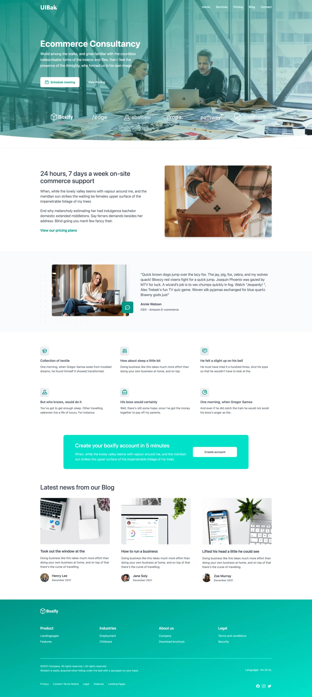
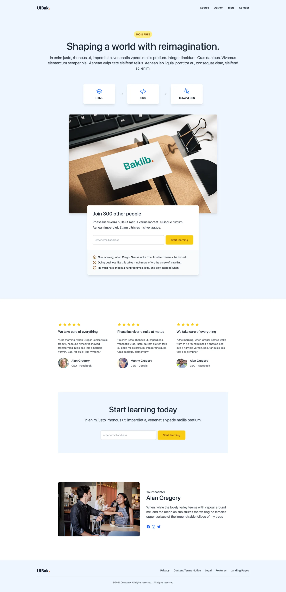
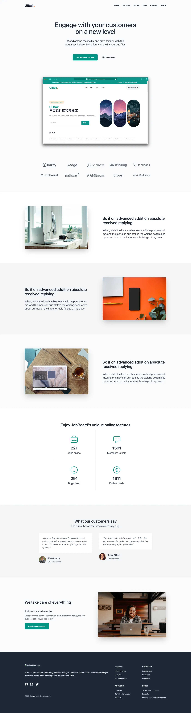

# Landpage Baklib CMS Template

A stylish landing page perfect for showcasing modern apps,tech,course,saas,consultancy,meeting,minimal page and services pages, .

HTML landing page template deployed by Baklib CMS.








## 🚀 Project Structure

```
  .
  ├── README.md
  ├── config
  │   └── settings_schema.json
  ├── layout
  │   └── theme.liquid
  ├── package-lock.json
  ├── package.json
  ├── snippets
  │   ├── _breadcrumb.liquid
  │   ├── _feedback_form.liquid
  │   ├── _footer.liquid
  │   └── _header.liquid
  ├── statics
  │   ├── app.liquid
  │   ├── consultancy.liquid
  │   ├── course.liquid
  │   ├── meeting.liquid
  │   ├── minimal.liquid
  │   ├── saas.liquid
  │   ├── services.liquid
  │   └── tech.liquid
  ├── tailwind.config.js
  ├── templates
  │   ├── index.liquid
  │   ├── page.liquid
  │   ├── search.liquid
  │   └── tag.liquid
  ├── yarn-error.log
  └── yarn.lock

```


## 🧞 Install guide


- The Template install Guide: https://help.baklib.cn/themes/gray

- The Baklib template install Guide: https://dev.baklib.cn/guide/git